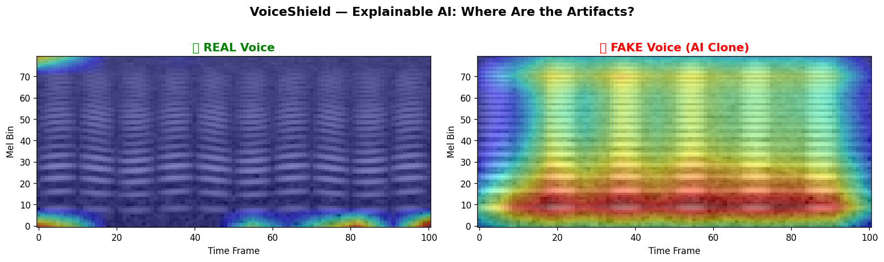

# VoiceShield 🛡️
> **AI-Powered Real-Time Detection & Prevention of Voice-Cloning Impersonation Attacks**
> **Smart India Hackathon (SIH 2026)** · **Problem Statement:** SIH26104 · **Team:** Red Flags

[](https://www.python.org/downloads/)
[](https://fastapi.tiangolo.com)
[](https://nextjs.org/)
[](https://pytorch.org/)
[](https://opensource.org/licenses/MIT)

---

## 📌 Executive Summary

India lost over **₹1,750 Crore in 2024–2025** to sophisticated cyber-extortion, including AI voice-cloning scams, digital arrest coercion, and fake relative emergency calls. 

**VoiceShield** is a carrier-grade, real-time fraud defense engine that analyzes live telephonic audio streams in **< 5 milliseconds** per 2-second window. It fuses acoustic deepfake detection, multilingual NLP intent analysis, and telephony metadata to stop financial fraud before money leaves the victim's account.

---

## 🏛️ 3-Layer Fusion Architecture

```
                       LIVE TELEPHONE AUDIO (8kHz / 16kHz PCM)
                                          │
                                          ▼
                ┌───────────────────────────────────────────────────┐
                │             Telephony Front-End DSP               │
                │  • ITU-T G.712 Bandpass Filtering (300-3400 Hz)   │
                │  • Silero VAD (Speech-gating & silence bypass)    │
                │  • 80-bin Log-Mel Spectrogram Extraction          │
                └───────────────────────────────────────────────────┘
                                          │
                  ┌───────────────────────┼───────────────────────┐
                  ▼                       ▼                       ▼
      ┌───────────────────────┐ ┌───────────────────┐ ┌───────────────────┐
      │  LAYER 1: Authenticity│ │  LAYER 2: Intent  │ │  LAYER 3: Signals │
      │  • MelCNN Acoustic    │ │  • Multilingual   │ │  • Call duration  │
      │    Feature Extractor  │ │    Whisper ASR    │ │  • International  │
      │  • Vocoder / Phase    │ │  • 12 Scam Lexicon│ │    prefix & route │
      │    Artifact Detection │ │    Classifiers    │ │  • VoIP signaling │
      │  • Grad-CAM Heatmap   │ │  • EN / HI /      │ │    risk heuristic │
      │    Explainability     │ │    Hinglish       │ │                   │
      └───────────────────────┘ └───────────────────┘ └───────────────────┘
                  │                       │                       │
                  └───────────────────────┼───────────────────────┘
                                          ▼
                ┌───────────────────────────────────────────────────┐
                │          3-Layer Dynamic Risk Fusion Engine       │
                │     Fused Score = 0.50×L1 + 0.30×L2 + 0.20×L3     │
                │           Rolling 5-Window Confidence             │
                └───────────────────────────────────────────────────┘
                                          │
                  ┌───────────────────────┼───────────────────────┐
                  ▼                       ▼                       ▼
            [ Score < 0.40 ]      [ 0.40 ≤ Score < 0.70 ]   [ Score ≥ 0.70 ]
               🟢 REAL                 🟡 SUSPICIOUS           🔴 FRAUD
           Call Continues             Warning Overlay       Auto-Hold Trigger
                                      Alert to User         SHA-256 Merkle Log
```

---

## 📊 Key Benchmark Metrics

| Metric | Result | Target | Status |
| :--- | :---: | :---: | :---: |
| **Layer 1 EER (held-out test)** | _re-measuring_ † | < 8% | 🔄 In progress |
| **Cross-generator EER (unseen TTS)** | _re-measuring_ † | < 15% | 🔄 In progress |
| **Inference Latency** | MelCNN ≈3  ms · dual-branch TBD | < 500 ms | ⚡ Headroom |
| **Layer 2 Intent F1-Score** | **0.969** | > 0.90 | ✅ Exceeded |
| **Multilingual Support** | English · Hindi · Hinglish | Indian telecom | ✅ Supported |
| **Evidence Chain** | Ed25519-signed SHA-256 hash-chain | BSA 2023 §63 | ⚖️ Tamper-evident + non-repudiable |

> † **Honest-metrics note:** earlier 100% accuracy / 0% EER figures were measured on the
> training data (evaluation leakage). The pipeline now trains on `manifest_train.json` and
> evaluates on a held-out `manifest_test.json`, plus a **held-out generator** for a true
> cross-generator number. Report those figures here after the next GPU run — a defensible
> 3–8% EER beats an unbelievable 0%.

---

## 🔍 Explainable AI (Grad-CAM Visual Heatmaps)

VoiceShield doesn't just produce a score — it explains **where** the synthetic artifacts exist:
- **Neural vocoder phase discontinuities** (high-frequency spectral blur).
- **Unnatural formant trajectories** in synthetic mel-bins.
- Live Grad-CAM Base64 PNGs streamed directly to the frontend dashboard.



---

## ⚖️ Legal & Regulatory Compliance

- **Bharatiya Sakshya Adhiniyam (BSA) 2023 §63**: Electronic records integrity guaranteed via cryptographically signed SHA-256 hash chains.
- **Digital Personal Data Protection (DPDP) Act 2023**: Raw audio is **never persisted** to disk. Frame buffers are processed purely in ephemeral RAM and zeroed out after feature extraction.

---

## 🚀 Quick Start Guide

### Prerequisites
- Python 3.10+ with PyTorch & CUDA support (optional for CPU)
- Node.js 18+ & npm

### 1. Start the FastAPI Backend
```bash
# Set PYTHONPATH to include backend_v2
$env:PYTHONPATH="backend_v2"   # Windows PowerShell
# export PYTHONPATH="backend_v2" # Linux / macOS

# Launch server
python -m uvicorn app.main:app --port 8000 --reload
```
API Documentation will be live at: [`http://localhost:8000/docs`](http://localhost:8000/docs)

### 2. Start the Next.js Frontend Dashboard
```bash
cd frontend
npm install
npm run dev
```
Open [`http://localhost:3000`](http://localhost:3000) to view the real-time monitoring console.

---

## 🧪 Running the Verification Test Suite

Run the full automated test suite (61+ passing tests):

```bash
# 1. Deep Model & GPU Stress Benchmark
python tests/test_model_deep.py

# 2. Intelligence Layer & Intent Classifier Benchmark (81 samples)
python -m intelligence.eval_intent
python -m intelligence.test_intent
python -m intelligence.test_layers

# 3. Backend Hash Chain & Telephony Tests
$env:PYTHONPATH="backend_v2"; python -m pytest backend_v2/tests/
```

---

## 📁 Repository Structure

```
voiceshield/
├── ai/                      # Layer 1 Deepfake Detection Engine
│   ├── layer1_authenticity.py  # Dual-Branch MelCNN + Wav2Vec2 Architecture
│   ├── preprocessing.py        # ITU-T G.712 Telephony simulation & Mel-spectrogram
│   ├── gradcam.py              # Explainable AI Grad-CAM heatmap generator
│   ├── models/                 # Model weights (best_mel_cnn.pt) & threshold.json
│   └── train/                  # Synthetic seed generator, trainer & evaluator
├── backend_v2/              # High-Throughput Production FastAPI Backend
│   ├── app/
│   │   ├── main.py             # App lifecycle & router registration
│   │   ├── inference.py        # Async ThreadPool inference bridge
│   │   ├── hash_chain.py       # SHA-256 Merkle chain evidence generator
│   │   ├── vad.py              # Silero VAD audio pipeline & ring buffer
│   │   └── routers/websocket.py # Real-time binary PCM streaming endpoint
│   └── tests/                  # Backend unit tests
├── frontend/                # Next.js 14 Dark-Mode Cybersecurity Dashboard
│   ├── app/page.tsx            # Live Threat Meter, 3-Layer breakdown & Alerts
│   ├── app/evidence/page.tsx   # Forensic Audit Trail & BSA 2023 §63 panel
│   ├── hooks/useMicStream.ts   # Web Audio API microphone capture hook
│   └── public/worklet.js       # Off-thread AudioWorklet 16kHz Int16 quantizer
├── intelligence/            # Layer 2 & 3 Intent & Telephony Signal Analyzers
│   ├── intent_classifier.py    # 12-category multilingual scam NLP engine
│   ├── call_signals.py         # Metadata heuristics & risk scoring
│   └── data/intent_samples.csv # 81-sample benchmark dataset
├── docs/                    # Pitch deck assets & Grad-CAM visualizations
└── tests/                   # End-to-end deep verification scripts
```

---

## 👥 Team Red Flags (SIH 2026)

- **Ojaswee (Team Lead)** — System Architecture, AI/ML Training & Integration
- **Tanishq** — Backend Engineering, High-Throughput WebSockets & Evidence Chain
- **Akshat & SK** — Cybersecurity Dashboard, Forensic Evidence UI & AudioWorklet
- **Team Members 5 & 6** — Presentation, Dataset Benchmarking & Regulatory Compliance

---

## 📄 License
This project is licensed under the MIT License — see the [LICENSE](LICENSE) file for details.
